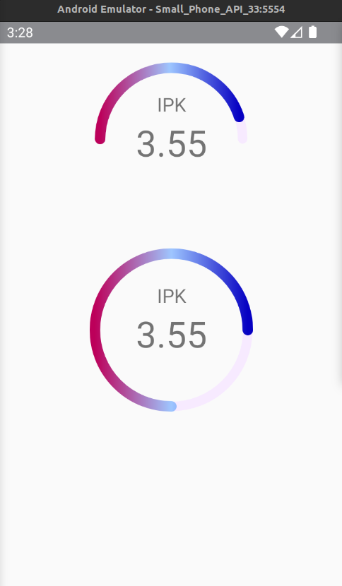

React Native Curve Proggress Bar

```

import React from 'react';
import {SafeAreaView, StatusBar, StyleSheet, Text, View} from 'react-native';
import {GaugeCurve, GaugeCircle} from 'gauge-curve';

function App(): React.JSX.Element {
  return (
    <SafeAreaView style={styles.container}>
      <StatusBar barStyle={'light-content'} backgroundColor="transparent" />
      <GaugeCurve
        value={90}
        gaugeColor="#F7EAFF"
        gaugeValueColor={['#BC005A', '#9EC6FF', '#0600C2']}
        gaugeStroke={5}
        gaugeValueStroke={5.5}
        insideTextColor="#0000ff"
        size={200}>
        <View style={styles.sectionContainer}>
          <Text style={styles.sectionIpk}>IPK</Text>
          <Text style={styles.sectionNilaiIpk}>3.55</Text>
        </View>
      </GaugeCurve>
      <GaugeCircle
        value={75}
        gaugeColor="#F7EAFF"
        gaugeValueColor={['#BC005A', '#9EC6FF', '#0600C2']}
        gaugeStroke={5}
        gaugeValueStroke={5.5}
        insideTextColor="#0000ff"
        size={200}>
        <View style={styles.sectionContainer}>
          <Text style={styles.sectionIpk}>IPK</Text>
          <Text style={styles.sectionNilaiIpk}>3.55</Text>
        </View>
      </GaugeCircle>
    </SafeAreaView>
  );
}

const styles = StyleSheet.create({
  container: {
    justifyContent: 'center',
    alignItems: 'center',
  },
  sectionContainer: {
    paddingTop: 50,
    justifyContent: 'center',
    alignItems: 'center',
  },
  sectionIpk: {
    fontSize: 20,
    fontWeight: '400',
    justifyContent: 'center',
    alignItems: 'center',
    paddingBottom: 6,
  },
  sectionNilaiIpk: {
    fontSize: 38,
    fontWeight: '400',
    justifyContent: 'center',
    alignItems: 'center',
    lineHeight: 45,
  },
});

export default App;

```

[Peer Depedences]()

`yarn add react-native-svg`

or

`npm i react-native-svg`


